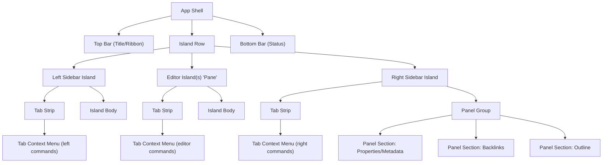

# @notes/ui

Shared UI primitives, structure language, and styling tokens for Notes.

## Canonical UI pieces

Use these names consistently across app code, docs, and future scripting APIs:

- **App Shell**: the full root layout.
- **Top Bar**: title/ribbon bar at the top.
- **Bottom Bar**: status bar at the bottom.
- **Island Row**: center region between top and bottom bars.
- **Island**: elevated rounded container in the island row.
- **Island Header / Body / Footer**: internal island slots.
- **Tab Strip**: tabs attached to an island.
- **Tab Context Menu**: right-click menu for island tabs.
- **Panel Group**: collection of sections in an island body.
- **Panel Section**: one section (for example: Properties, Outline, Backlinks).

Current island types:

- **Left Sidebar Island**: file explorer flows.
- **Editor Island(s)**: one or more note-workspace islands.
- **Right Sidebar Island**: inspector panels (properties/metadata, backlinks, outline).

## Nesting and sibling structure

## Conventions for building new UI

1. Start with these primitives and names; do not introduce parallel names for the same concept.
2. Keep shared UI elements in `packages/ui`; app layers compose them.
3. Keep tab interaction structure shared, while each island provides its own context-menu commands.
4. Prefer token-based styling and small concern-specific CSS files (`tokens.css`, `shell.css`, `island.css`, `tabs.css`, `panel.css`, `menu.css`).
